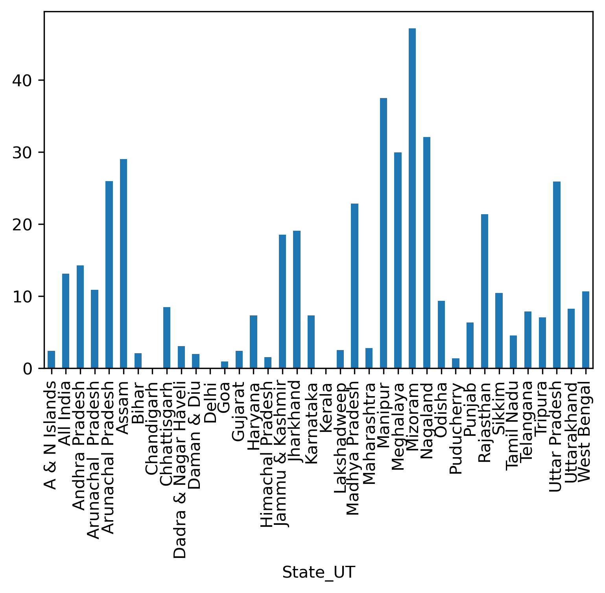
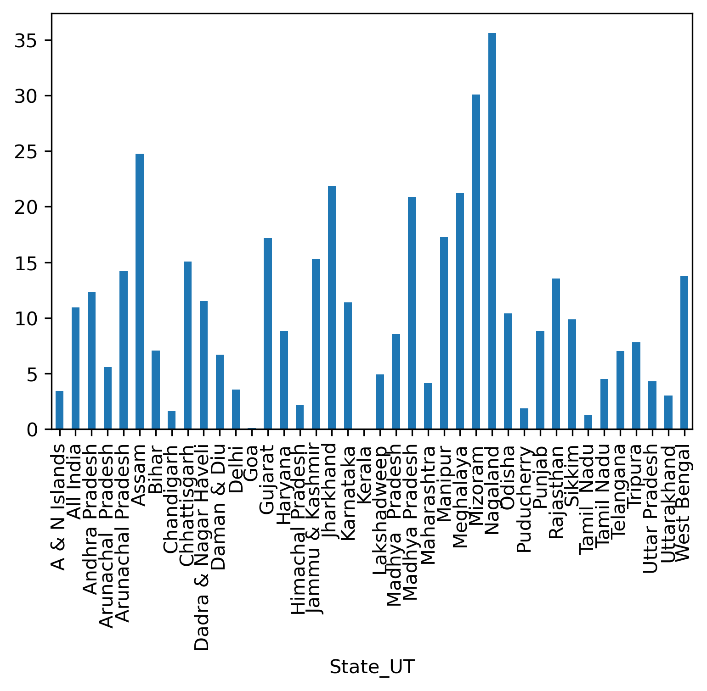
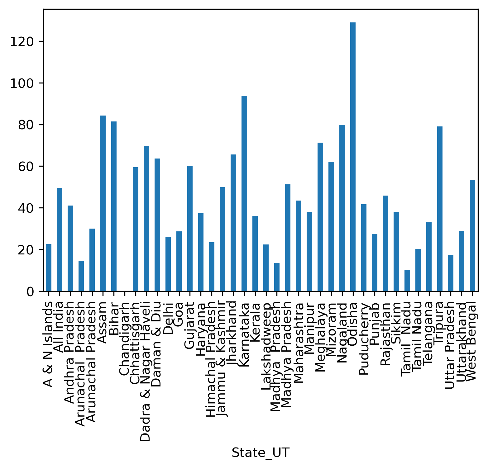
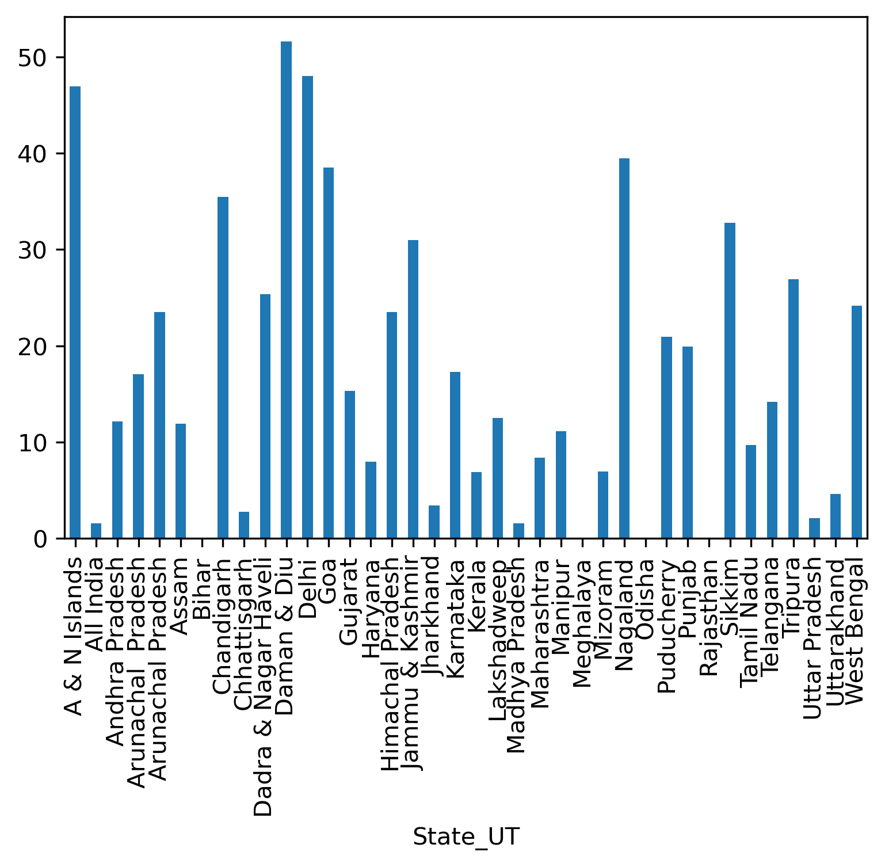

## Data-analysis-of-indian-schools

### Some useful questions answer by this notebook

- Which state has maximum dropout in primary school, Upper primary school, Secondary school, Higher Secondary school?

### The State has Highest Percentages of dropout of **Primary schools**:

### The State has Highest Percentages of dropout of **Upper Primary schools**:

### The State has Highest Percentages of dropout of **Secondary schools**:

### The State has Highest Percentages of dropout of **Higher Secondary school**:

